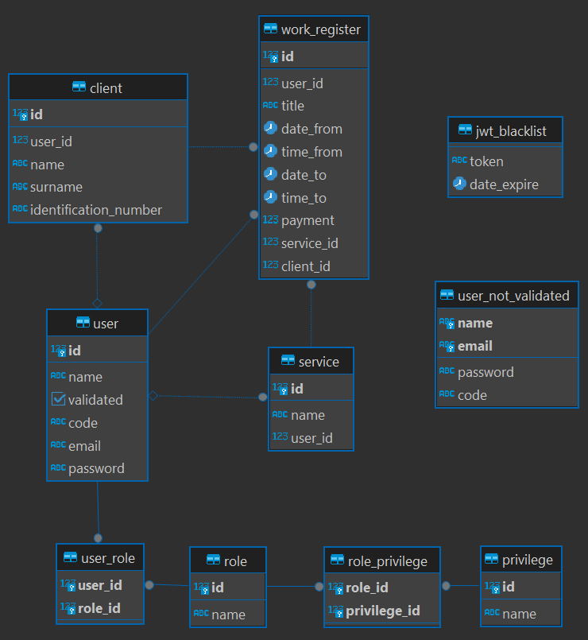

# WORKS REGISTER
## Project Description

Api Rest made with:
- Classic Architecture - Controller - Service - Entity.
- S.O.L.I.D. Principles.
- Java 17.
- Framework Spring boot 3.
- Liquibase - For Database creation and migration.
- Relational Database - Postgres.
- Swagger 3.
- Testing with JUnit 5, Mockito and TestContainer.
- Code Review with SonarQube.
- Spring Security with Basic Authentication.
- Spring Security with OAuth2 GitHub Authentication and JSession.
- Implement Spring Security with JWT on the Basic Auth.
- Encrypt application.properties values with jasypt.

D.E.R:

## To do

- ~~Implement Spring Security with Basic Authentication.~~
- ~~Implement Spring Security with OAuth2 GitHub Authentication and JSession.~~
- ~~Implement Spring Security with JWT on the Basic Auth.~~
- Create new EndPoints for Info of the owner User authenticated with Basic Auth.
- Develop Frontend using Angular 15 or 16.
- Rewrite unit tests using BDD.
- Use kubernetes to run all the project.
- Implement CI/CD.
- Implement Clean Architecture and create a new project based on this.
- Subdivide this project into microservices and use Apache Kafka or RabitMQ.

# Notes for the DEVs
# Jasypt
 - Due to the implementation of jasypt to run the application it is necessary to send the environment variable JASYPT_ENCRYPTOR_PASSWORD.
 - Example to encrypt values in application.properties:
   1. spring.datasource.username=**DEC**(ExampleUserName)
   2. mvn jasypt:encrypt -Djasypt.encryptor.password=UltraSecretPassword
   3. Result: spring.datasource.username=**ENC**(ger86g65e4aga4ge5g445dfgLYS47l)